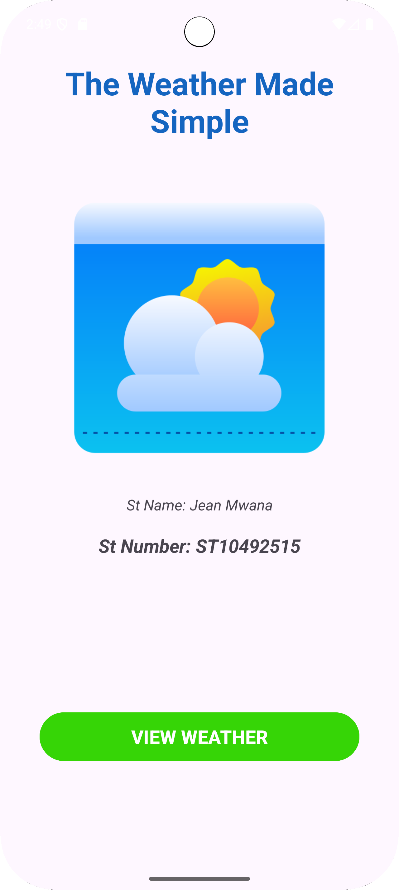
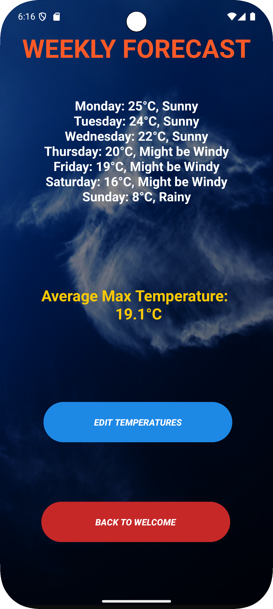
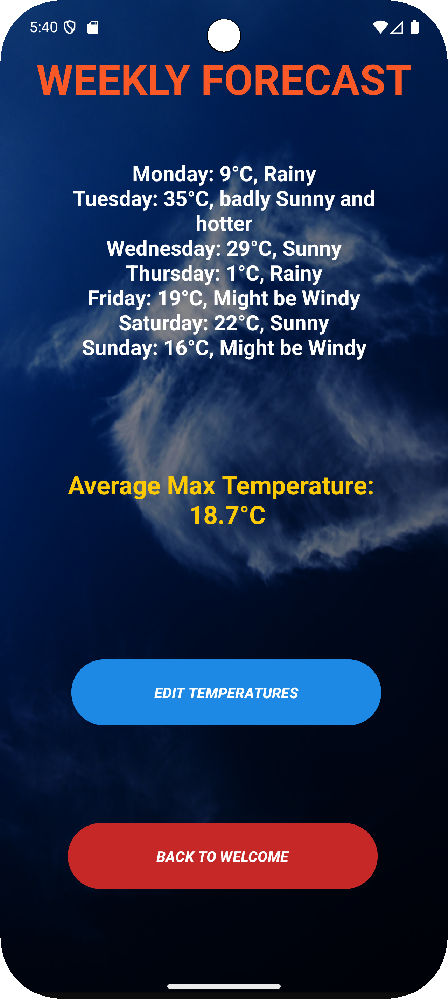
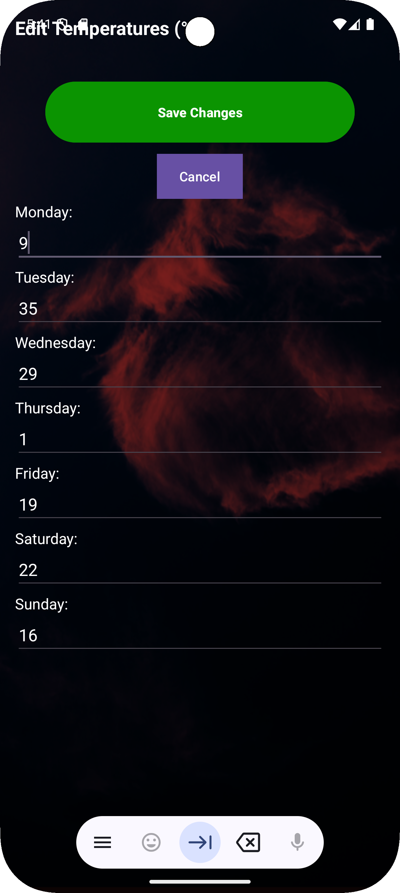

# Advanced Weather App

A advanced Android weather app that display weekly temperatures and can edit or input new temperatures. I called this the MOD of the previous version called : "AndroWeather App"

## Features
1. **Welcome Screen**
    - App name and developer information
    - Start button to view weather

2. **Weather Display Screen**
    - Shows daily maximum temperatures 
    - Displays the maximum temperature and weather condition for each day of the week. 
    - Calculates and displays the average maximum temperature for the week. 
    - A "Back" button to return to the Welcome Screen. 
    - An "Edit Temperatures" button to navigate to the Input Screen.
   

3. **Input Screen (New for MOD prototype)**:
    - Allows users to view and change the maximum temperature for each day of the week.
    - Dynamically generated input fields for temperatures.
    - "Save Changes" button to update temperatures and return to the Main Screen.
    - "Cancel" button to return to the Main Screen without saving changes.

4. * **Data Management**:
   - Uses a Singleton object (`WeatherData`) to manage and share weather data across activities.

## How to Use
1. **Welcome Screen**
    - Click "View Weather" to see weekly forecast

2. **Weather Display Screen**
    - View temperatures
    - See average temperature at bottom

3. **Input Screen
    - Edit and add new temperatures
    - click on "saves changes" to save and update temperatures
    - click on "Cancel" to return to the weather screen without changes

## Code Structure
- **MainActivity**: Welcome screen with navigation
- **WeatherDisplayActivity**: Shows weather data and handles calculations
- **Input Screen**

### Key Components
- **Parallel Arrays**: Two arrays store days, temperatures
- **While Loops**: Used for data display and average calculation
- **Intents**: Handle navigation between screens

## 🛠️ Technologies Used

* **Platform**: Android
* **Language**: Kotlin
* **IDE**: Android Studio
* **Core Components**:
   * Activities & Layouts (XML)
   * TextView, Button, ImageView, EditText, LinearLayout, ScrollView
   * Singleton for data management
   * MutableLists for dynamic data
   * Loops (for iteration and calculation)
   * Intents (for screen navigation)
   * InputType for numeric EditText fields

## Screenshots
1. Welcome Screen  
   
2. Weather Display
   
   
3. Input Screen
   

##  Author

* **Name**: [Jin Kaneki]
* **Student Number**: [ST10492515]

link to the repository:https://github.com/Jeankaneki/WeatherAppMOD.git

thanks.
